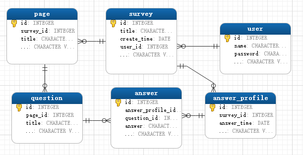
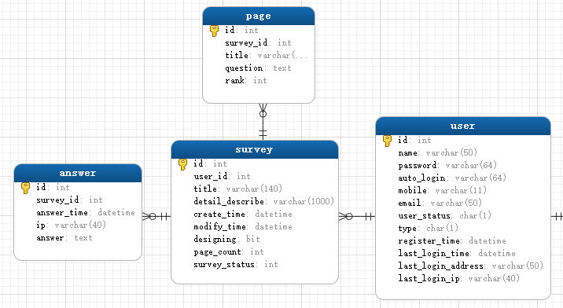

# 调查相关的表
## 最开始的表结构
最初我计划的表结构为:

这样的数据表结构应该是很好想出来的. 感觉比较符合在数据库课上学的, 每个实体对应一张表, 每个属性对应一列. 咋一看, 挺好的. 程序可以这样写:

1. 用户点击添加问题链接
2. 跳转到添加问题页面, 用户填写问题的相关信息
3. 保存问题到数据库, 跳到设计问卷页面.

但是这样做体验应该是很不好的吧?
当然可以使用ajax:

1. 用户点击添加问题链接
2. 动态生成一个div, 由用户来填写相关的信息
3. 完成编辑, 通过ajax发送到后台
4. 存储到数据库, 并将id返回给前台
5. 前台接收id, 以后用户再做修改直接通过id向后台发送ajax

但是, 在第3步和第5步之间是有时间间隔的, 如果网速很慢, 那么间隔可能会很大. 如果当中用户修改了数据, 实际上是没法提交的, 因为没有id. 所以需要等待回传的id. 当然, 由于每创建一个问题都需要一次数据库交互, 所以, 访问频率可能太高了. 如果需要使用批量添加, 那么比上面的还麻烦.

这样的表结构的问题有两点:

- 前台需要维护题目是否已经有id值了等状态, 然后向服务器发送数据时, 要携带添加、 修改 和 删除 等信息. 而后台也需要根据这些信息去进行不同的处理.
- 删除问卷时, 需要删除与之关联的回答, 级联删除的层数有点太多了吧? 效率上是否有点低了.

## 修改后的表结构

我把表结构修改成了下面这样:

原因如下:

- 虽然每个问题都可以作为一个单独的个体. 但是, 在这里应该不会去单独去查询某个问题, 最少也是去查询某个页面.  同理, 我们不会去查询某个一问题的某个答案, 而是去统计一个调查问卷的所有答案. 也就是说, 页面 和 一次回答的答案 才是查询的基本单位.
- 每个问题都没有自己的id. 所以, 我们不需要去维护id等信息. 虽然页面也有id, 但是比较少, 相对而言比较好维护. 而且由于页面的数量比较少, 所以可以通过一些方法不去维护id.
- 在删除的时候, 需要级联删除的层数相对减少.
- 之所以创建page表, 而不是把page也变成survey的一个字段是因为, 以后可能修改程序逻辑, 用户参与调查时, 一次只加载一个页面, 而不是像现在这样全部加载出来.

**缺点**

- 这样的表结构在使用增量更新的时候, 服务器端可能需要进行一些比较复杂的处理, 但是应该是可以进行批量更新的
- 这样的表结构导致`page`表的`rank`字段 和 `answer`表的`answer`字段有可能会很长, 虽然使用了`text`类型, 还是存在字段不够长的情况. 但是大多数情况下应该还是可以应付. 所以先这样处理.
- 在进行更复杂的统计时, 只能使用`like`去进行查询, 可能会出现一些效率问题. 由于比较复杂的统计用的几率可能并不是太大. 而且实际上参与调查的人可能也不是特别的多. 如果太慢全文索引也有可能有帮助. 这个问题也只能暂时放一放.

## 传输、存储结构

### 问题的传输、存储格式

问题的存储和传输格式就是实体类对应的json格式.

### 回答的传输格式

- 调查: (问题答案)*
- 问题答案: (QUESTION\_START)(问题题号)(QUESTION\_EXCISION)(问题答案)?
- ANSWER\_START 为 `ASCII` 码 `30` 对应的字符 或者说是 `\u001E`
- ANSWER\_EXCISION 为 `ASCII` 码 `31` 对应的字符 或者说是 `\u001F`
- 问题题号 和 页面页码 从1开始

### 回答的存储格式

answer表中的answer字段存储参与问卷调查的结果. 格式为:

- answer字段: (问题答案)*(后缀站哨) (注: 为了方便处理, 需要保证答案按照题目顺序排列)
- 问题答案: (ANSWER\_START)(问题题号)(ANSWER\_EXCISION)(用户回答)?
- 后缀站哨: (ANSWER\_START)(最大题号加一)

### 特定题型的传输存储格式

- 单选题答案为: 选项的编号(从0开始)
- 多选题答案格式为: ,(选项的编号,)* 比如 ",1,3,4,". 也就是说选项的前后都有逗号(选项编号从0开始)

## page使用什么格式更合适

最初我是准备中下面的格式的. 但是我打算这个网站最开始只支持单选和多选. 然后测试, 调整, 之后再去支持其他问题类型. 由于我并没有去仔细考虑其他问题类型所需要的选项等信息, 所以需要足够高的可扩展性, 以免到时候需要修改问题格式. 所以虽然json需要更多的流量; 而且解析json可能会比较慢(这个只是感觉, 不大确定), 但是我还是决定使用json. 以免接下来程序的大幅度修改.

那么这里使用什么格式会更合适呢? 尤其是现在智能手机这么流行, 虽然我并没有打算去支持手机端. 但是假如, 我是说假如, 需要支持手机端, 那么流量问题可能就会更加突出, 到时候需要去再创建一个格式去减少流量吗? 关于手机端的东西, 我几乎是一点都不知道... 手机端是以什么格式去传输数据呢, json? 还是自己定义一个针对自己应用的格式?

### 原本的`page`结构

~~**(页面信息)(QUESTION\_START)** 或者 **(页面信息)(QUESTION\_START)(问题)[(QUESTION\_EXCISION)(问题)]**~~

~~也就是说以页面信息开始, 接着是分割符, 最后是n个问题, 每个问题之间使用(QUESTION_EXCISION)作为分割符. 下面给出页面信息和问题的格式:~~

~~- 页面信息: **(标题)(QUESTION\_MODULE)(次序)(QUESTION\_MODULE)(其他信息)**~~
~~- 问题: **(题型)(QUESTION\_MODULE)(标题)(QUESTION\_MODULE)([选项等信息])(QUESTION\_MODULE)(其他信息)**~~
~~- 各个模块如果还需要分割的话, 可以使用 **(MODULE\_EXCISION)** 进行分割~~

~~其中:~~

~~- **QUESTION\_START 为 `ASCII` 码 `2` 对应的字符 或者说是 `\u0002`**~~
~~- **QUESTION\_EXCISION 为 `ASCII` 码 `1D` 对应的字符 或者说是 `\u001D`**~~
~~- **QUESTION\_MODULE 为 `ASCII` 码 `1E` 对应的字符 或者说是 `\u001E`**~~
~~- **MODULE\_EXCISION 为 `ASCII` 码 `1F` 对应的字符 或者说是 `\u001F`**~~
