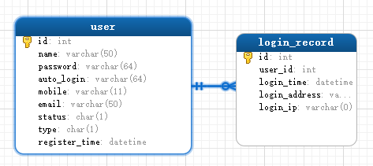

# 关于用户数据表

`user`表是否有必要分成两张表:

这样以来, 由于`user`表中的数据并不经常变化, 所以可以使用二级缓存进行缓存. 理由如下:

- 像这种调查网站, 一般情况下, 一个用户发布了一个调查以后, 在短期内可能会经常登录网站, 查看有多少人参与了调查. 这个时候缓存命中率实际上应该是比较高的. 而像现在的表结构, 由于用户每次登录都会修改对应的记录, 导致缓存实际上是起不到作用的, 只是在浪费存储空间.
- 修改过表结构以后, `login_record`里不仅可以记录最后一次的登录记录, 还可以记录n次的. 之后可以没一两个月删除一次过期数据.
